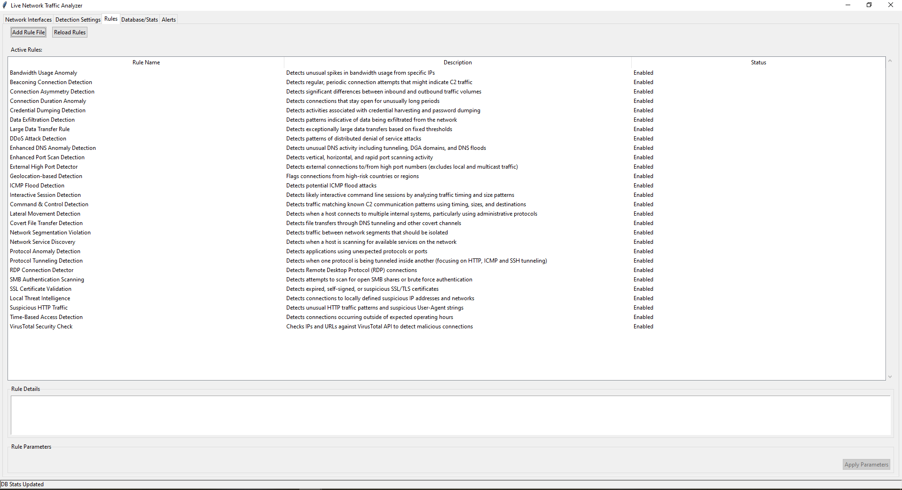

# Traffic Monkey

A comprehensive network traffic analyzer and security monitoring tool for detecting and alerting on suspicious network activity.




## Overview

Traffic Monkey is a Python-based desktop application that captures and analyzes network traffic in real-time. It employs a rule-based detection system to identify potential security threats, unusual network behavior, and suspicious connections. With an intuitive GUI, system tray integration, and desktop notifications, Traffic Monkey provides continuous network monitoring without getting in your way.

## Key Features

- **Live Traffic Capture**: Capture and analyze network packets in real-time using Wireshark's tshark engine
- **Modular Detection Rules**: Extensible rule system for identifying various network threats
- **Comprehensive Visualization**: Multiple specialized views for analyzing different aspects of network traffic
- **VirusTotal Integration**: Check suspicious IPs and URLs against VirusTotal's database
- **System Tray Operation**: Run silently in the system tray with notification alerts
- **Persistent Database**: SQLite storage with optimized read/write operations for historical traffic analysis
- **Customizable Settings**: Adjust detection thresholds to match your network environment
- **False Positive Management**: Mark and exclude known good connections from alerts
- **Geographical Analysis**: Map IP locations and analyze traffic origins (with optional GeoIP database)

### Detection Capabilities

- **RDP Connection Monitoring**: Track Remote Desktop Protocol usage
- **Large Data Transfer Detection**: Identify unusually large data flows
- **Suspicious Connection Detection**: Flag connections to known suspicious IP ranges
- **DNS Anomaly Detection**: Identify potential DNS tunneling and DGA domains
- **External High Port Detection**: Monitor connections on non-standard high ports
- **ICMP Flood Protection**: Detect potential ping-based attacks
- **Port Scan Detection**: Identify port scanning activities
- **SSL Certificate Validation**: Detect expired or suspicious SSL certificates
- **Time-Based Access Detection**: Alert on activity during unusual hours

## Visualization & Analysis Views

Traffic Monkey provides multiple specialized views to analyze your network traffic:

- **By IP Address**: View alerts grouped by IP addresses with detailed information per IP
- **By Alert Type**: Analyze alerts categorized by detection rule types
- **Possible Malicious**: Focus on potentially malicious IPs with their alert history
- **Threat Leaderboard**: See a ranked view of the most suspicious IPs based on alert diversity
- **Connection Graph**: Visualize network connections between IPs as an interactive graph
- **Geo Location**: Map the geographical origin of IP addresses (requires GeoIP databases)
- **Alert Timeline**: Visualize alert patterns over time to identify trends
- **HTTP/TLS Monitor**: Analyze HTTP requests and TLS connections with security assessments
- **Database Browser**: Explore and query the raw database tables directly

## Requirements

- **Python**: Version 3.6 or higher
- **Wireshark/tshark**: Latest stable version recommended
  - Must be added to system PATH for Traffic Monkey to function
- **Operating System**: Windows 10/11, Linux (Ubuntu 18.04+, Debian 10+), macOS 10.15+
- **System Resources**: 
  - Minimum: 4GB RAM, 100MB disk space
  - Recommended: 8GB RAM, 1GB+ disk space for database growth
- **Network Access**: Admin/root privileges for packet capture
- **VirusTotal API Key**: Free tier API key (optional but recommended)
- **GeoIP Databases**: MaxMind GeoLite2 databases (optional, for geo-location features)

## Installation

### Prerequisites

1. Install Python 3.6+ from [python.org](https://www.python.org/downloads/)
2. Install Wireshark from [wireshark.org](https://www.wireshark.org/download.html)
   - During installation, ensure "Install TShark" option is selected
   - Make sure tshark is added to your system PATH

### Windows Installation

```powershell
# Clone the repository
git clone https://github.com/EdwardDali/TrafficMonkey.git
cd TrafficMonkey

# Create virtual environment (optional but recommended)
python -m venv venv
.\venv\Scripts\activate

# Install dependencies
pip install -r requirements.txt

# Create .env file for VirusTotal API key
echo "VIRUSTOTAL_API_KEY=your_api_key_here" > .env

# Run the application (as Administrator)
python main.py
```

### Linux Installation

```bash
# Install tshark
sudo apt-get update
sudo apt-get install tshark
# Select 'Yes' when asked about allowing non-root users to capture packets

# Clone the repository
git clone https://github.com/EdwardDali/TrafficMonkey.git
cd TrafficMonkey

# Create virtual environment (optional but recommended)
python3 -m venv venv
source venv/bin/activate

# Install dependencies
pip install -r requirements.txt

# Create .env file for VirusTotal API key
echo "VIRUSTOTAL_API_KEY=your_api_key_here" > .env

# Run the application
sudo python main.py
```

### macOS Installation

```bash
# Install tshark via Homebrew
brew install wireshark

# Clone the repository
git clone https://github.com/EdwardDali/TrafficMonkey.git
cd TrafficMonkey

# Create virtual environment (optional but recommended)
python3 -m venv venv
source venv/bin/activate

# Install dependencies
pip install -r requirements.txt

# Create .env file for VirusTotal API key
echo "VIRUSTOTAL_API_KEY=your_api_key_here" > .env

# Run the application
sudo python main.py
```

## Required Python Packages

The following packages are required (included in requirements.txt):
- tkinter (Python's standard GUI library)
- pillow (for image processing)
- pystray (for system tray integration)
- plyer (for desktop notifications)
- python-dotenv (for environment variables)
- requests (for API communication)
- geoip2 (for IP geo-location, optional)
- sqlite3 (standard library, for database operations)

## Running Traffic Monkey

Traffic Monkey needs elevated privileges to capture network traffic:

- **Windows**: Right-click and select "Run as Administrator"
- **Linux/macOS**: Run with sudo (`sudo python main.py`)

### First-time Setup

1. Launch the application
2. Select a network interface in the "Network Interfaces" tab
3. Click "Start Capture" to begin monitoring
4. Configure detection rules in the "Rules" tab
5. Explore the other tabs to become familiar with the interface
6. For geo-location features, download the MaxMind GeoLite2 databases:
   - Download from MaxMind or [GeoLite.mmdb repository](https://github.com/P3TERX/GeoLite.mmdb)
   - Place the `.mmdb` files in the `utils` folder:
     - GeoLite2-City.mmdb
     - GeoLite2-Country.mmdb
     - GeoLite2-ASN.mmdb

## Architecture

Traffic Monkey consists of several key components:

- **LiveCaptureGUI**: Main application window and user interface
- **TrafficCaptureEngine**: Handles packet capture using tshark
- **RuleLoader**: Dynamically loads detection rules from the rules directory
- **SubtabLoader**: Dynamically loads alert visualization subtabs
- **SystemTrayApp**: Manages system tray icon and desktop notifications
- **DatabaseManager**: Manages dual-database architecture for separate read/write operations
- **Rule**: Base class for all detection rules
- **SubtabBase**: Base class for all alert visualization subtabs

The application uses a dual-database architecture:
- **Capture Database**: Optimized for write operations during packet capture
- **Analysis Database**: Optimized for read operations during analysis
- Regular synchronization ensures both databases remain up-to-date

The databases store:
- Connection information (source/destination IPs, ports, bytes transferred)
- Alerts generated by detection rules
- Rule configuration
- Protocol-specific data (DNS, HTTP, TLS, etc.)
- Alert metadata for subtab visualization

## Detection Rules System

Traffic Monkey uses a flexible rule-based system for detecting suspicious network activity. Rules are Python classes that inherit from the base `Rule` class and can be dynamically loaded at runtime.

### Built-in Rules

- **Large Data Transfer Detector**: Identifies unusually large data transfers that could indicate data exfiltration. Configurable threshold allows adjustment for different network environments.

- **Local Threat Intelligence**: Detects connections to known suspicious IP addresses and networks from a local threat intelligence database. Can be customized with your own list of suspicious IPs and networks.

- **Suspicious HTTP Traffic**: Analyzes HTTP traffic patterns to identify suspicious User-Agent strings, request paths, and potential SQL injection attempts. Monitors HTTP traffic on non-standard ports.

- **Time-Based Access Detection**: Identifies network connections occurring outside of normal operating hours, which could indicate unauthorized access. Configurable work hours and days.

- **SSL Certificate Validation**: Detects expired, self-signed, or suspicious SSL/TLS certificates in encrypted traffic. Can alert on weak cryptographic algorithms and wildcard certificates.

### Creating Custom Rules

Create new rules by adding Python files to the `rules` directory. Each rule must:

1. Inherit from the `Rule` class
2. Implement the `analyze()` method to detect suspicious activity
3. Return a list of alert messages

Example rule structure:

```python
class MyCustomRule(Rule):
    def __init__(self):
        super().__init__(
            name="My Custom Rule",
            description="Detects something suspicious"
        )
        self.threshold = 1000  # Example configuration parameter
        
    def analyze(self, db_cursor):
        alerts = []
        # Query the database and look for suspicious patterns
        # Add alert messages to the alerts list
        return alerts
    
    def get_params(self):
        # Return configurable parameters
        return {
            "threshold": {
                "type": "int",
                "default": 1000,
                "current": self.threshold,
                "description": "Threshold for detection"
            }
        }
    
    def update_param(self, param_name, value):
        # Handle parameter updates
        if param_name == "threshold":
            self.threshold = int(value)
            return True
        return False
```

## Modular Alert Visualization System

Traffic Monkey features a plugin-based system for visualizing alerts through customizable subtabs. This allows for flexible and extensible ways to view and interact with detected alerts.

### Directory Structure

Alert visualization plugins (subtabs) are stored in the `alerts/subtabs` directory. Each subtab is a Python file that defines a class inheriting from `SubtabBase`.

### Built-in Subtabs

Traffic Monkey comes with several built-in alert visualization subtabs:

1. **By IP Address** (`ip_alerts_subtab.py`)
   - Displays alerts grouped by IP address
   - Shows alert counts, messages, and timestamps
   - Includes detailed view of alerts for each IP
   - Provides filtering by IP address
   - Integrates with false positive management

2. **By Alert Type** (`alert_type_subtab.py`)
   - Groups alerts by rule name or alert type
   - Shows counts of each alert type
   - Displays detailed alert instances for each rule
   - Provides filtering by rule name
   - Shows distribution of affected IPs per rule

3. **Possible Malicious** (`malicious_subtab.py`)
   - Provides a focused view of potentially malicious IP addresses
   - Shows alert types, status, and detection timestamps
   - Extracts IPs from alert messages for comprehensive coverage
   - Filters out local and trusted IPs
   - Integrates with false positive management

4. **Threat Leaderboard** (`leaderboard_subtab.py`)
   - Creates a ranked view of threats by IP address
   - Shows distinct alert types and total alerts per IP
   - Displays detailed rule triggers for each IP
   - Highlights IPs that trigger multiple detection rules
   - Integrates with false positive management

5. **Alert Timeline** (`alert_timeline_subtab.py`)
   - Visualizes alerts over time to identify patterns and trends
   - Supports different time ranges (1h, 6h, 12h, 24h, 7d, 30d)
   - Color-coded display by alert type
   - Shows statistics like peak times and alert density
   - Interactive timeline for investigating specific time periods

6. **Geo Location** (`geo_location_subtab.py`)
   - Visualizes alerts with geographical information
   - Shows country, city, and regional data for alerts
   - Includes ASN (Autonomous System Number) information
   - Provides world map visualization for alert locations
   - Requires GeoLite2 databases in the utils folder

7. **HTTP/TLS Monitor** (`https_subtab.py`)
   - Monitors HTTP requests and TLS connections
   - Provides security assessment of TLS versions and cipher suites
   - Detects potentially vulnerable connections
   - Displays detailed certificate information
   - Alerts on outdated or insecure cryptographic methods

8. **Connection Graph** (`connection_graph_subtab.py`)
   - Visualizes network connections between IPs as a graph
   - Shows traffic volume through adjustable line weights
   - Provides filtering and focus capabilities on specific IPs
   - Offers customizable graph visualization options

9. **Database Browser** (`db_browser.py`)
   - Provides direct access to the database tables
   - Allows running custom SQL queries
   - Supports exporting query results to CSV
   - Shows detailed table schema information
   - Useful for advanced analysis and debugging

### Creating Custom Subtabs

Create new subtabs by adding Python files to the `alerts/subtabs` directory. Each subtab must:

1. Inherit from the `SubtabBase` class
2. Implement the `create_ui()` method to build user interface elements
3. Implement the `refresh()` method to update data display

Example subtab structure:

```python
class MyCustomSubtab(SubtabBase):
    def __init__(self):
        super().__init__(
            name="My Custom View",
            description="Custom visualization of alerts"
        )
        self.example_tree = None  # Will be created in create_ui()
        
    def create_ui(self):
        # Create user interface components
        gui.tab_factory.create_control_buttons(
            self.tab_frame,
            [{"text": "Refresh Data", "command": self.refresh}]
        )
        
        # Create TreeView or other UI components
        self.example_tree, _ = gui.tab_factory.create_tree_with_scrollbar(
            self.tab_frame,
            columns=("column1", "column2"), 
            headings=["Column 1", "Column 2"]
        )
        
    def refresh(self):
        # Update the data display
        gui.tree_manager.clear_tree(self.example_tree)
        
        # Query database for data
        gui.db_manager.queue_query(
            gui.db_manager.get_some_data,
            callback=self._update_display
        )
        
    def _update_display(self, data):
        # Update UI with fresh data
        gui.tree_manager.populate_tree(self.example_tree, data)
```

### Hot-Reloading Capability

Traffic Monkey's subtab system supports hot-reloading plugins without restarting the application:

1. Add or modify subtab files in the `alerts/subtabs` directory
2. Click the "Reload Subtabs" button in the Alerts tab
3. New or modified subtabs will immediately appear in the interface

## Usage Scenarios

### Home Network Monitoring

Monitor your home network for:
- Unauthorized access attempts
- Malware communication with command and control servers
- Unusual data transfers that might indicate compromised devices
- Geographical origins of incoming connections
- Suspicious HTTPS certificates and encryption methods

### Small Business Security

- Track Remote Desktop Protocol (RDP) usage for compliance
- Monitor for data exfiltration attempts
- Detect network reconnaissance activities like port scanning
- Identify suspicious activity patterns with the timeline view
- Export evidence for further investigation

### Network Troubleshooting

- Identify bandwidth hogs and unusual traffic patterns
- Track connection statistics to problematic services
- Monitor DNS queries for resolution issues
- Analyze HTTP and TLS traffic in detail
- Query the database directly for custom analysis

## Troubleshooting

### Common Issues

#### "tshark not found" error
- Ensure Wireshark is installed with the TShark component
- Verify tshark is in your system PATH:
  - Windows: Open Command Prompt and type `where tshark`
  - Linux/macOS: Open Terminal and type `which tshark`
- If not found, add the directory containing tshark to your PATH:
  - Windows: Add the Wireshark installation directory (typically `C:\Program Files\Wireshark`) to your PATH
  - Linux: Usually installed to `/usr/bin/tshark`
  - macOS: If installed via Homebrew, typically in `/usr/local/bin/tshark`

#### Permission errors on startup
- Run the application with administrator/root privileges
- On Linux, ensure the appropriate capabilities are set:
  
```bash
sudo setcap cap_net_raw,cap_net_admin=eip /usr/bin/dumpcap
```

#### No interfaces showing in the interface list
- Verify you have at least one active network interface
- Run the application with elevated privileges
- Check if Wireshark can detect interfaces when run manually
- Try toggling the "Show Inactive Interfaces" option

#### Database errors
- Check if the `db` directory exists and is writable
- If database is corrupted, delete the `db/capture.db` and `db/analysis.db` files and restart
- Use the "Check Tables" function in the HTTP/TLS Monitor tab to diagnose database issues
- Verify the log file for any SQL errors

#### Missing alert subtabs
- Verify the `alerts/subtabs` directory exists and has properly formatted Python files
- Check application logs for errors loading specific subtab plugins
- Try using the "Reload Subtabs" button in the Alerts tab
- Ensure you have the proper permissions to read the subtab files

#### Geo-location features not working
- Ensure you've downloaded the MaxMind GeoLite2 databases and placed them in the `utils` folder
- Required files: GeoLite2-City.mmdb, GeoLite2-Country.mmdb, GeoLite2-ASN.mmdb
- Use the "Load Databases" button in the Geo Location tab to reload the databases
- Check the logs for any errors loading the databases

#### Performance issues
- If the application becomes slow, consider reducing the capture window size
- Adjust the batch size in the Detection Settings tab
- Use the Database Browser to check database size and consider archiving old data
- On lower-end systems, disable subtabs you don't actively use

### Log File Location

Logs are stored in the `logs` directory and can help diagnose issues:
- Windows: `[installation_path]\logs\traffic_analyzer.log`
- Linux/macOS: `[installation_path]/logs/traffic_analyzer.log`

Packet samples (for debugging) are stored in:
- `[installation_path]/logs/packets/`

## Customization

### Adding Custom Rules

1. Create a new Python file in the `rules` directory
2. Implement a class that inherits from `Rule`
3. Define detection logic in the `analyze()` method
4. Restart the application to load the new rule

### Adding Custom Alert Subtabs

1. Create a new Python file in the `alerts/subtabs` directory
2. Implement a class that inherits from `SubtabBase`
3. Define UI components in the `create_ui()` method
4. Implement data refresh in the `refresh()` method
5. Use the "Reload Subtabs" button to load without restarting

### Configuring VirusTotal Integration

1. Sign up for a free VirusTotal API key at [virustotal.com](https://www.virustotal.com)
2. Create or edit the `.env` file in the application root directory
3. Add the line: `VIRUSTOTAL_API_KEY=your_api_key_here`
4. Restart the application

### Extending the Database Schema

The database schema is defined in `capture_fields.py`. To add new fields:

1. Add field definitions to the `CAPTURE_FIELDS` list
2. Add table definitions to `TABLE_DEFINITIONS` if needed
3. Increment the `SCHEMA_VERSION` value
4. Restart the application for schema updates to take effect

## Security Considerations

- Traffic Monkey requires elevated privileges to capture packets
- All data is stored locally in SQLite databases
- No data is sent externally except for VirusTotal API checks (if enabled)
- Consider network security implications of running packet capture tools
- Review the rules before using in sensitive environments

## Contributing

Contributions to Traffic Monkey are welcome! Please feel free to submit pull requests or open issues on GitHub.

1. Fork the repository
2. Create a feature branch (`git checkout -b feature/amazing-feature`)
3. Commit your changes (`git commit -m 'Add some amazing feature'`)
4. Push to your branch (`git push origin feature/amazing-feature`)
5. Open a Pull Request

## Acknowledgments

- Wireshark/TShark for packet capture capabilities
- VirusTotal for threat intelligence integration
- MaxMind for GeoIP database support
- Python community for excellent libraries and tools
